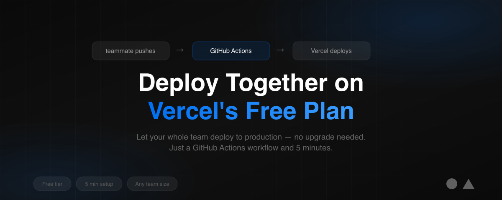

<p align="center">
  
</p>

<h1 align="center">Vercel GitHub Actions Deploy Skills</h1>

<p align="center">
  Let your whole team deploy to Vercel on the <strong>free Hobby plan</strong> — no Pro upgrade needed.<br/>
  A skill for <a href="https://cursor.com">Cursor</a>, <a href="https://docs.anthropic.com/en/docs/claude-code">Claude Code</a>, <a href="https://codeium.com/windsurf">Windsurf</a>, and other AI coding assistants.<br/><br/>
  Follows the <a href="https://github.com/anthropics/agent-skills-spec">Agent Skills specification</a>.
</p>

<p align="center">
  <a href="#install-the-skill">Install</a> &bull;
  <a href="#what-you-need-to-do-user-intervention-required">Setup Guide</a> &bull;
  <a href="#quick-usage">Quick Usage</a> &bull;
  <a href="#faq">FAQ</a>
</p>

---

## The Problem

Vercel's free plan ties deployments to the **account owner**. When a teammate pushes to `main`, Vercel checks the git commit author and rejects it. You'd normally need a Pro plan ($20/mo per member) to fix this.

## The Solution

This skill teaches AI coding assistants to set up a GitHub Actions workflow that:

1. Triggers on every push to `main` (by **anyone**)
2. Rewrites the commit author to the Vercel account owner (on the CI runner only — repo history untouched)
3. Uses the Vercel CLI to build and deploy to production

```
Teammate pushes to main → GitHub Actions triggers → Author overridden → Deployed to Vercel
```

---

## Install the Skill

### Option A: Using `npx skills` (Recommended)

```bash
npx skills add itsOmSarraf/vercel-github-actions-deploy-skills
```

### Option B: Cursor

```bash
git clone https://github.com/itsOmSarraf/vercel-github-actions-deploy-skills ~/.cursor/skills/vercel-github-actions-deploy
```

Then ask Cursor: *"Set up Vercel deployment with GitHub Actions"* — it will automatically use this skill.

### Option C: Claude Code

```bash
git clone https://github.com/itsOmSarraf/vercel-github-actions-deploy-skills ~/.claude/skills/vercel-github-actions-deploy
```

### Option D: Manual (no AI assistant)

Just copy a workflow file from `examples/` and follow the [setup guide](templates/deploy-workflow-template.md).

---

## What You Need to Do (User Intervention Required)

The AI assistant will generate the workflow YAML file, but **you must provide 5 values manually**. The assistant **cannot** obtain these for you.

### Step 1: Create a Vercel Deploy Token

1. Go to **[vercel.com/account/tokens](https://vercel.com/account/tokens)**
2. Click **Create Token**
3. Name it anything (e.g. `github-actions`)
4. **Copy the token** — you won't see it again

> This becomes your `VERCEL_TOKEN` secret.

### Step 2: Get Your Org ID and Project ID

```bash
npm install -g vercel   # Install CLI if needed
npx vercel link         # Follow prompts to link your project
```

This creates `.vercel/project.json`:

```json
{
  "orgId": "team_aBcDeFgHiJkLmN",
  "projectId": "prj_xYzAbCdEfGhIjK"
}
```

> These become your `VERCEL_ORG_ID` and `VERCEL_PROJECT_ID` secrets.
>
> Make sure `.vercel` is in your `.gitignore`.

### Step 3: Know the Vercel Account Owner's Identity

You need the **email** and **display name** of the person who owns the Vercel project.

> These become your `DEPLOY_EMAIL` and `DEPLOY_NAME` secrets.

### Step 4: Add All 5 Secrets to GitHub

Go to: `https://github.com/<owner>/<repo>/settings/secrets/actions`

| Secret Name | Where to Get It | Example |
|-------------|-----------------|---------|
| `VERCEL_TOKEN` | [vercel.com/account/tokens](https://vercel.com/account/tokens) | `pZt7x...` |
| `VERCEL_ORG_ID` | `.vercel/project.json` → `"orgId"` | `team_aBcDeFgHiJkLmN` |
| `VERCEL_PROJECT_ID` | `.vercel/project.json` → `"projectId"` | `prj_xYzAbCdEfGhIjK` |
| `DEPLOY_EMAIL` | Vercel account owner's email | `owner@example.com` |
| `DEPLOY_NAME` | Vercel account owner's name | `Om Sarraf` |

### Step 5 (Optional): Prevent Double Deploys

If the account owner also pushes directly, Vercel's Git integration will deploy **alongside** GitHub Actions. To prevent this:

1. Go to **Vercel Dashboard** → your project → **Settings** → **Git**
2. Set **Ignored Build Step** to: `exit 0`
3. Save

---

## Repository Structure

```
vercel-github-actions-deploy-skills/
├── SKILL.md                              # Skill definition (for AI assistants)
├── README.md                             # This file
├── LICENSE                               # MIT license
│
├── examples/                             # Ready-to-use workflow files
│   ├── deploy-bun.yml                    # GitHub Actions workflow (Bun)
│   ├── deploy-npm.yml                    # GitHub Actions workflow (npm)
│   ├── deploy-pnpm.yml                   # GitHub Actions workflow (pnpm)
│   └── README.md                         # Examples documentation
│
└── templates/                            # Detailed guides
    ├── deploy-workflow-template.md       # Full setup + advanced config + troubleshooting
    └── README.md                         # Templates overview
```

## Quick Usage

Once you've completed the 5 steps above:

1. Copy the workflow file matching your package manager from `examples/` to `.github/workflows/deploy.yml`
2. Push to `main`
3. Watch it deploy in the **Actions** tab

| Package Manager | Lock File | Workflow File |
|----------------|-----------|---------------|
| Bun | `bun.lock` | `examples/deploy-bun.yml` |
| npm | `package-lock.json` | `examples/deploy-npm.yml` |
| pnpm | `pnpm-lock.yaml` | `examples/deploy-pnpm.yml` |

## Features

- Works on Vercel's **free Hobby plan**
- Supports **Bun**, **npm**, and **pnpm**
- **Auto-deploys** on push to `main`
- **Manual deploy** button via `workflow_dispatch`
- Repo git history stays **untouched**
- Env vars fetched automatically from Vercel
- Covers **PR preview deploys**, **monorepos**, and **Slack notifications** in the [template guide](templates/deploy-workflow-template.md)

## FAQ

**Will I get double deploys if I'm the account owner?**
Yes — one from Vercel's Git integration, one from GitHub Actions. Set the **Ignored Build Step** to `exit 0` in Vercel project settings to prevent this (see Step 5 above).

**Does the author override mess with my git history?**
No. The rewrite only happens inside the disposable GitHub Actions runner.

**Does this work with monorepos?**
Yes. See the [setup guide](templates/deploy-workflow-template.md#monorepo-support) for details.

**What about environment variables?**
`vercel pull` fetches them automatically from the Vercel dashboard. They must already be configured there.

## Links

- [Vercel CLI Documentation](https://vercel.com/docs/cli)
- [GitHub Actions Documentation](https://docs.github.com/en/actions)
- [Vercel Tokens Page](https://vercel.com/account/tokens)
- [Agent Skills Specification](https://github.com/anthropics/agent-skills-spec)

## License

MIT — use it however you want.

## Credits

Based on the [original gist](https://gist.github.com/itsOmSarraf/c26b68c59a683411f23c4e6bf76f6311) by [@itsOmSarraf](https://github.com/itsOmSarraf).

Inspired by [sarvamai/skills](https://github.com/sarvamai/skills) skill structure.
